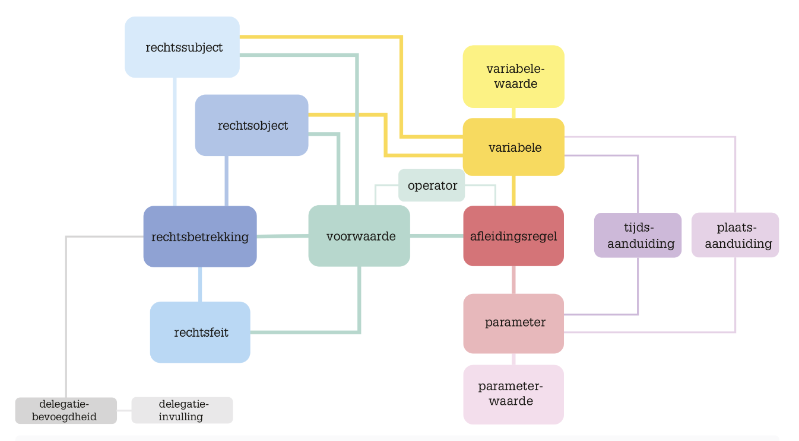

# JAS

## Juridisch Analyschema
Het juridische analyseschema bevat de juridische elementen in wetgeving, met nog enige verfijningen daarin. Het werk van de Amerikaanse jurist Wesley Newcomb Hohfeld [[?HOHFELD_1]] vormt een belangrijke basis voor het analyseschema. Hij beschreef al in het begin van de twintigste eeuw verschillende soorten rechten en plichten, op basis van Amerikaanse jurisprudentie [[?HOHFELD_2]].

Vanaf 2012 heeft het samenwerkingsverband de Blauwe Kamer op basis van het werk van Hohfeld een referentiemodel voor wetgeving ontwikkeld [[?BLKAMER]]. Dit referentiemodel is op zijn beurt weer de basis geweest voor het hier gespecificeerde juridische analyseschema.

In bovenstaande figuur zien we de verschillende klassen van het juridische analyse schema terugkomen als gekleurde blokjes. De gebruikte kleuren passen we toe in de voorbeelden van classificaties. Verder staan tussen de blokjes lijnen. Deze lijnen geven aan dat tussen twee blokjes een of meer relaties bestaan. We hebben vanuit het oogpunt van overzichtelijkheid niet alle lijnen weergegeven.

## Elementen uit het JAS

In onderstaande tabel zijn de omschrijvingen van alle elementen uit het juridisch analyseschema opgenomen.

Om een klasse te kunnen herkennen in een wettekst helpt het om gebruik te maken van een of meer vragen die vergelijkbaar zijn met de vragen die gesteld worden bij zinsontleding in de grammatica. Deze vragen benoemen we per klasse en we besteden ook aandacht aan de uitdrukkingswijze in de wetgeving.

### Rechtssubject

|                       |                                       |
|-----------------------|---------------------------------------|
| **voorkeursterm**     | <dfn>Rechtssubject</dfn> |
| **Omschrijving klass**| Een rechtssubject is de drager van rechten en plichten. Het is een partij in een rechtsbetrekking. |
| **vraag**             | Vragen voor het vinden van een rechts subject kunnen zijn: Wie heeft het recht? Wie heeft de plicht? Van wie is een rechtsobject? Bij wie hoort een waarde? |
| **uitdrukkingswijze** | Een rechts subject is te herkennen aan een zelfstandig naamwoord waarmee een persoon of andere entiteit wordt beschreven, of aan een persoonlijk voornaamwoord zoals ‘hij’, ‘zij’ en soms ook ‘het’. Maar ook een onbepaald of betrekkelijk voornaamwoord kan wijzen op een rechts subject, bijvoorbeeld ‘iemand’, ‘een ieder’ of ‘degene’. |

### Rechtsobject

|                       |                                       |
|-----------------------|---------------------------------------|
| **voorkeursterm**     | <dfn>Rechtsobject</dfn> |
| **Omschrijving klass**| Een rechtsobject is het voorwerp van een rechtsbetrekking en/of rechtsfeit. Een rechtsobject kan zowel een fysieke (bijvoorbeeld een personenauto of een huis) als een niet-fysieke verschijningsvorm (bijvoorbeeld medische zorg) hebben. |
| **vraag** | Vragen voor het vinden van een rechtsobject kunnen zijn: Wat is het voorwerp van een recht of plicht? Waar is het rechts subject eigenaar of houder van? Waar heeft een waarde betrekking op? Waarover is iets verschuldigd? |
| **uitdrukkingswijze** | Een rechtsobject is te herkennen aan een zelfstandig naamwoord waarmee het voorwerp van een recht of plicht wordt omschreven, bijvoorbeeld een studie, een woning of een dienstbetrekking. Ook een aanwijzend of betrekkelijk voornaamwoord kan wijzen op een rechtsobject, bijvoorbeeld ‘dat’, ‘hetgeen’ en ‘welk(e)’. |

### Rechtsbetrekking

|                       |                                       |
|-----------------------|---------------------------------------|
| **voorkeursterm**     | <dfn>Rechtsbetrekking</dfn> |
| **Omschrijving klass**| Een rechtsbetrekking is een juridische relatie tussen twee rechts subjecten en beschrijft een specifieke juridische toestand tussen deze rechts subjecten. Een van deze rechts subjecten heeft een plicht en de ander het bijbehorend recht. De algemene juridische toestand van een rechts subject is de verzameling van alle specifieke rechtsbetrekkingen waarin dit rechts subject als rechthebbende of plichthebbende partij optreedt. |
| **vraag** | Vragen voor het vinden van een rechtsbetrekking kunnen zijn: Hoe verhouden twee rechts subjecten zich tot elkaar? Welke relatie(s) hebben twee rechts subjecten met elkaar? |
| **uitdrukkingswijze** | Een rechtsbetrekking is te herkennen aan een of meer werkwoorden. Bijvoorbeeld in de vorm van een combinatie van een hoofdwerkwoord met een hulpwerkwoord:<ol type="i"><li>bij een recht: ‘kan verzoeken’ of ‘mag wijzigen’;</li><li> bij een plicht: ‘stelt vast’, ‘mag niet inhalen’, ‘is verplicht informatie te verstrekken’, ‘moet informeren’ of ‘dient te voldoen’.</ol> Daarnaast is een rechtsbetrekking bijvoorbeeld te herkennen aan een samengesteld werkwoord:<ol type="i"><li>bij een recht: ‘heeft recht op’ of ‘heeft aanspraak op’;</li><li>bij een plicht: ‘heeft de plicht om’ of ‘draagt de last om’.</li> |

### Rechtsfeit

|                       |                                       |
|-----------------------|---------------------------------------|
| **voorkeursterm**     | <dfn>Rechtsfeit</dfn> |
| **Omschrijving klass**| Een rechtsfeit is een handeling of gebeurtenis die, of tijdsverloop dat een wijziging in de juridische toestand teweegbrengt. Aan een rechtsfeit zijn dus rechtsgevolgen verbonden die een rechtsbetrekking creëren, wijzigen of beëindigen. |
| **vraag** | Een vraag voor het vinden van een rechtsfeit kan zijn: Wat is de gebeurtenis of handeling die, of het tijdsverloop dat gevolgen heeft voor de rechtsbetrekking? |
| **uitdrukkingswijze** | Een rechtsfeit is te herkennen aan een actieve werkwoordsvorm, al dan niet in combinatie met een zelfstandig naamwoord, zoals ‘indienen van een bezwaarschrift’, ‘toekennen van een subsidie’, ‘horen van belanghebbende’ of ‘kenbaar maken van elektronische bereikbaarheid’. |

### Voorwaarde

|                       |                                       |
|-----------------------|---------------------------------------|
| **voorkeursterm**     | <dfn>Voorwaarde</dfn> |
| **Omschrijving klass**| Een voorwaarde is een conditie die beschrijft aan welke omstandigheid voldaan moet zijn voor het intreden van een rechtsgevolg. Een voor waarde kan ook betrekking hebben op een rechts subject of op een waarde die bij een rechtsobject of bij een afleidingsregel hoort. Een voorwaarde bevat vaste elementen, die in de logica operanden en operatoren worden genoemd. Operanden kunnen rechts subjecten of rechtsobjecten, eigenschappen van rechts subjecten of rechtsobjecten, berekeningen of waarden zijn. Een operator is de beschrijving van een vergelijking die in de voorwaarde voorkomt, zoals ‘groter dan’, ‘kleiner dan’ en ‘gelijk aan’. |
| **vraag** | Vragen voor het vinden van een voorwaarde kunnen zijn: Welke eisen worden gesteld aan een rechts subject, een rechtsobject, een rechtsbetrekking of een rechtsfeit? Onder welke omstandigheden geldt een waarde bij een rechtsobject? |
| **uitdrukkingswijze** | Een voorwaarde is te herkennen aan een voorwaardelijke bijzin, in de meeste gevallen ingeleid door een voegwoord zoals ‘indien’, ‘als’, ‘tenzij’, ‘mits’ of een combinatie van woorden, zoals ‘met dien verstande dat’ of ‘met uitzondering van’. Ook kan een voorwaarde afgeleid worden uit een bijwoord bij een werkwoord, zoals ‘schriftelijk’ of ‘elektronisch’. Voorwaarden kunnen enkelvoudig of samengesteld zijn. Een samengestelde voorwaarde bestaat uit verschillende eisen die alle vervuld moeten zijn (cumulatief) of waarvan er één vervuld moet zijn (alternatief). |

### Afleidingsregel

|                       |                                       |
|-----------------------|---------------------------------------|
| **voorkeursterm**     | <dfn>Afleidingsregel</dfn> |
| **Omschrijving klass**| Een afleidingsregel is een regel die nieuwe feiten of waarden creëert met behulp van bestaande feiten of waarden. Te denken valt aan regels die bepalen of een recht bestaat (een beslisregel), of die de hoogte en duur van een recht bepalen (een rekenregel). De variabele die vastgesteld wordt door de afleidingsregels, noemen we uitvoervariabele. Bij een rekenregel is dit de uitkomst van de rekensom. De variabelen die gebruikt worden voor de vaststelling, noemen we invoervariabelen. In geval van een rekenregel zijn dit in feite de getallen waarmee wordt gerekend. Als sprake is van vaste getallen of waarden in een afleidingsregel die over een periode gelijk zijn voor alle rechts subjecten en rechtsobjecten, noemen we deze parameters. Afleidingsregels worden ook gebruikt om te bepalen of een rechts subject of rechtsobject tot een bepaalde doelgroep behoort; het gaat dan om het afleiden van specialisaties van rechts subjecten en rechtsobjecten op basis van bepaalde kenmerken. |
| **vraag** | Vragen voor het vinden van een afleidingsregel kunnen zijn: Hoe wordt een variabele berekend of afgeleid? Hoe wordt een specifiek rechts subject of rechtsobject bepaald? |
| **uitdrukkingswijze** | Een afleidingsregel is te herkennen aan woorden die duiden op een berekening of afleiding, zoals ‘is (…) verminderd met’, ‘bedraagt (…) vermeerderd met’, ‘wordt gesteld op’ of ‘is het gezamenlijke bedrag van’, maar ook eenvoudigweg ‘en’. |

### Variabele(waarde)

|                       |                                       |
|-----------------------|---------------------------------------|
| **voorkeursterm**     | <dfn>Variabele</dfn> en <dfn>Variabelewaarde</dfn> |
| **Omschrijving klass**| Een *variabele* is een kenmerk van een rechts subject, rechtsobject, rechtsbetrekking of rechtsfeit dat voor verschillende instanties daarvan (dus voor specifieke personen, zaken, relaties, handelingen of gebeurtenissen in de werkelijkheid) een andere waarde kan hebben. Een *variabelewaarde* geeft de waarde aan die een bepaalde variabele kan hebben. De wijze waarop een variabelewaarde is omschreven in wetgeving kan een beperking in de mogelijke waarden voor een variabele inhouden, of een voorwaarde aan een variabele stellen. Variabele en variabelewaarde zijn verschillende klassen, maar vanwege de nauwe samenhang beschouwen we ze hier tezamen. |
| **vraag** | Vragen voor het vinden van een variabele kunnen zijn: Wat zijn de specifieke kenmerken van een rechtsobject, rechts subject, rechtsbetrekking of rechtsfeit? Welke eigenschappen worden genoemd? Welke waarde heeft een rechtsobject? Hoe lang of hoe hoog is een rechtsobject? Een variabelewaarde kan worden gedetecteerd met vragen als: Welk bedrag, welke duur of welke hoogte hoort bij deze variabele? |
| **uitdrukkingswijze** | De volgende varianten van een variabele met variabelewaarde kunnen we in elk geval herkennen in de wetgeving.  Een getal of datum: Soms bevat de wetgeving termen die een omvang, duur of andere grootheid tot uitdrukking brengen, zoals een bedrag, een datum of een aantal dagen. Dan is een variabelewaarde te herkennen aan een concreet bedrag, een concrete datum, een concrete tijdsduur of een andere numerieke waarde.  Een tekst: Een variabele kan een variabelewaarde hebben die bestaat uit een tekst. Een voorbeeld van zo’n variabele is ‘naam van een werkgever’.  Een enumeratiewaarde: Soms bevat de wetgeving een limitatieve opsomming van de mogelijke waarden van een variabele. Deze limitatieve opsomming van variabelewaarden wordt in de logica geduid met de term enumeratiewaarde. Enumeratiewaarden kunnen bijvoorbeeld in getallen of in tekst worden uitgedrukt.  Een booleaanse waarde: Een bijzondere enumeratiewaarde in tekst is een booleaanse waarde. Deze heeft slechts twee mogelijke waarden, te weten ‘ja’ (waar) of ‘nee’ (onwaar). Hiermee kunnen we uitdrukken of een bepaald kenmerk van een rechts subject, rechtsobject, rechtsbetrekking of rechtsfeit van toepassing of aanwezig is. Een voorbeeld van zo’n variabele is ‘geregistreerd in het donorregister’. De variabelewaarden zijn hier ‘ja’ of ‘nee’. |

### Parameter(waarde)

|                       |                                       |
|-----------------------|---------------------------------------|
| **voorkeursterm**     | <dfn>Parameter</dfn> en <dfn>Parameterwaarde</dfn> |
| **Omschrijving klass**| Een *parameter* is een beschrijving van een waarde die gelijk is voor alle rechtssubjecten, rechtsobjecten, rechtsbetrekkingen en rechtsfeiten. Vanwege de stabiele waarde wordt een parameter ook wel constante genoemd. Parameters worden gebruikt in afleidingsregels en voorwaarden. In de regel geldt een parameter voor een bepaalde periode, bijvoorbeeld een kalenderjaar, maar hij kan ook voor een onbepaalde duur gelden (bijvoorbeeld voor de hele geldigheidsduur van de wettelijke regel). De waarde die een parameter in de desbetreffende periode heeft, is een *parameterwaarde*. De parameter is dus de omschrijving van de waarde, en de parameterwaarde is de concrete waarde die daaraan is toegekend. Ook deze klassen beschouwen we tezamen vanwege de nauwe samenhang tussen beide. |
| **vraag** | Een vraag voor het vinden van een parameter of parameterwaarde kan zijn: Is sprake van een waarde die gedurende een periode een vaste hoogte heeft voor alle rechtssubjecten en rechtsobjecten? |
| **uitdrukkingswijze** | Een parameter heeft een vaste waarde over een periode. Een parameter is te herkennen aan een beschrijving van een waarde, bijvoorbeeld van een tarief, een (drempel)bedrag (eventueel met een maximum of een minimum) of een vrijstelling. Een parameterwaarde drukt de waarde van de parameter(beschrijving) uit over een periode. Een parameterwaarde is te herkennen aan bijvoorbeeld een bedrag in geld, een percentage en een datum. |

### Operator

|                       |                                       |
|-----------------------|---------------------------------------|
| **voorkeursterm**     | <dfn>Operator</dfn> |
| **Omschrijving klass**| Een operator is een woord, een combinatie van woorden of een teken dat een rekenkundige bewerking, een samengestelde voorwaarde, een gelijkstelling of een vergelijking van twee waarden of berekeningen uitdrukt. Een operator beschrijft hoe verschillende elementen van een berekening, voorwaarde of samengestelde voorwaarde met elkaar verbonden worden om tot een resultaat te leiden. Er zijn verschillende typen operatoren: <ol type="a"><li>rekenkundige operatoren: deze voeren een rekenkundige bewerking uit, zoals bijvoorbeeld optellen, aftrekken en vermenigvuldigen;<li>vergelijkingsoperatoren: deze vergelijken variabelen met elkaar of een variabele met een parameter (variabele is groter dan parameter of variabele is kleiner dan parameter);<li>logische operatoren: deze bepalen bij samengestelde voorwaarden of aan (tenminste) één van de voorwaarden moet worden voldaan (OF, disjunctie, alternatief) of aan alle voorwaarden (EN, conjunctie, cumulatief). Ook kan er sprake zijn van een voorwaarde waaraan niet voldaan mag zijn (NIET, negatie). |
| **vraag** | Vragen voor het vinden van operatoren zijn: Hoe worden variabelen of parameters verbonden in een berekening? In welke verhouding staan voorwaarden tot elkaar? Welke vergelijking wordt in een voorwaarde gemaakt? |
| **uitdrukkingswijze** | Een rekenkundige operator is te herkennen aan formuleringen zoals ‘het gezamenlijke bedrag van’, ‘de som van’, ‘vermeerderd met’, ‘verminderd met’ of ‘percentage van’. Een vergelijkingsoperator is te herkennen aan de woorden ‘groter dan’, ‘kleiner dan’, ‘meer bedraagt dan’ of ‘is gelijk aan’. Een logische operator is te herkennen aan de woorden ‘en’, ‘of’, ‘niet’ of ‘ten minste’. |

### Tijdsaanduiding

|                       |                                       |
|-----------------------|---------------------------------------|
| **voorkeursterm**     | <dfn>Tijdsaanduiding</dfn> |
| **Omschrijving klass**| Een tijdsaanduiding is een omschrijving van een tijdstip of tijdvak. Een tijdsaanduiding is nodig om de geldigheid van een rechtsbetrekking te duiden, om een tijdsverloop met rechtsgevolg uit te drukken of als variabele bij een specifiek rechtssubject of rechtsobject. Ook kan een tijdsaanduiding (met name een tijdstip) een parameterwaarde zijn. Een voorbeeld is een peildatum die wordt vergeleken met een andere datum (als variabele) in een voorwaarde. De tijdsaanduiding is als aparte klasse opgenomen, hoewel deze ook beschouwd zou kunnen worden als een verduidelijking van de klassen variabele of parameter. Gelet op het belang van de tijdsaanduiding voor het bepalen van de duur van een rechtsbetrekking of het tijdstip van een tijdsverloop met rechtsgevolgen, is tijdsaanduiding als aparte klasse opgenomen. Een formulering kan zowel tot de klasse tijdsaanduiding als tot de klasse parameter of variabele behoren. Als dat zich voordoet, kiezen we bij de analyse voor de meest specifieke klasse, dus de tijdsaanduiding. |
| **vraag** | Vragen voor het vinden van tijdsaanduidingen kunnen zijn: Wanneer, op welk moment? Sinds wanneer of tot wanneer, vanaf welk moment of tot welk moment? |
| **uitdrukkingswijze** | Tijdsaanduidingen zijn te herkennen aan een concrete datum (bijvoorbeeld 1 september 2009), of aan een omschrijving die een datum beschrijft (de eerste maandag van de maand). Tijdvakken zijn vaak te herkennen aan woorden die een periode duiden, zoals jaar, maand, week en dag of specialisaties van dit soort woorden, zoals kalenderjaar. |

### Plaatsaanduiding

|                       |                                       |
|-----------------------|---------------------------------------|
| **voorkeursterm**     | <dfn>Plaatsaanduiding</dfn> |
| **Omschrijving klass**| Een plaatsaanduiding is een plaats of een gebied waar bepaalde wetgeving betrekking op heeft. Zij bepaalt het toepassingsbereik van de regels voor rechtssubjecten, rechtsobjecten, rechtsbetrekkingen of rechtsfeiten. De meeste wetgeving geldt voor heel Nederland en heeft daarom geen expliciete plaatsaanduiding. Zodra het werkingsgebied beperkter of ruimer moet zijn, wordt in wetgeving wel een expliciete plaatsaanduiding opgenomen. Net als de tijdsaanduiding is de plaatsaanduiding apart opgenomen in het juridische analyseschema, hoewel deze gezien zou kunnen worden als een variabele of parameter. Een formulering in de wetgeving kan zowel tot de klasse plaatsaanduiding als tot de klasse parameter of variabele behoren. Als dit zich voordoet, kiezen we voor de meest specifieke klasse, namelijk de plaatsaanduiding. |
| **vraag** | Een vraag voor het vinden van een plaatsaanduiding kan zijn: Waar (voor welk gebied of welke plaats) geldt de wettelijke regel (niet)? |
| **uitdrukkingswijze** | De plaatsaanduiding wordt uitgedrukt met een algemene beschrijving van het gebied (een lidstaat van de EU) of met de naam van een specifiek gebied (de gemeente Amsterdam, de provincie Limburg, Nederland, Zwitserland). |

### Delegatiebevoegdheid/-invulling

|                       |                                       |
|-----------------------|---------------------------------------|
| **voorkeursterm**     | <dfn>Delegatiebevoegdheid</fn> en <dfn>Delegatie-invulling</dfn> |
| **Omschrijving klass**| Een *delegatiebevoegdheid* maakt het mogelijk of schrijft voor dat (nadere) regels worden gesteld over een rechtsbetrekking, rechtsfeit of afleidingsregel. Met *delegatie-invulling* duiden we de regeling of het regelingsonderdeel aan waarin de delegatiebevoegdheid is gebruikt. Hoewel de delegatiebevoegdheid en de delegatie-invulling aparte klassen zijn, beschouwen we ze hier gezamenlijk vanwege hun nauwe samenhang. Een delegatiebevoegdheid wordt altijd aan een specifiek rechts subject toegekend; dat kan de regering zijn (bij een amvb, vastgesteld door de Koning) of een minister (bij een ministeriële regeling). Het kan gaan om verplichte of een facultatieve delegatie (zie onder het kopje Uitdrukkingswijze). In het eerste geval moeten de in de wet genoemde onderwerpen worden uitgewerkt in een lagere regeling. In het tweede geval is er een keuze om de wettelijke regels al dan niet uit te werken. Ook is vaak subdelegatie mogelijk. Dat betekent dat bepalingen in een amvb verder kunnen worden uitgewerkt in een ministeriële regeling (zie ook bij uitdrukkingswijze). Het herkennen van delegatiebevoegdheden is vooral van belang voor het bepalen van het werkgebied van de Wets analyse. Als de delegatiebevoegdheid daadwerkelijk is gebruikt, moet de op grond daarvan vastgestelde gedelegeerde regelgeving in het werkgebied worden betrokken. De delegerende wet bevat logischerwijs geen concrete verwijzingen naar de delegatie-invulling. Die is immers op het moment van voorbereiden van die wet nog niet vastgesteld. Ook in de delegerende regeling zijn de grondslagen niet altijd eenvoudig op artikelniveau terug te vinden. In hoofdstuk 5 gaan we in op mogelijk heden om de kenbaarheid van delegatiegrondslagen in gedelegeerde regelingen te verbeteren. Voor het in kaart brengen van de gedelegeerde regelingen die tot het werkgebied behoren, kan gebruik gemaakt worden van de wetsinformatie die in wetten.nl bij een artikel is opgenomen. Deze is echter niet altijd volledig. Afstemming met wetgevingsjuristen om het werkgebied compleet te maken is daarom van belang. |
| **vraag** | Vragen voor het vinden van delegatiebevoegdheden of -invullingen kunnen zijn: Geeft een wetsartikel de opdracht om (nadere) regels te stellen? Verwijst een bepaling in een gedelegeerde regeling naar een artikel in de bovenliggende wet? |
| **uitdrukkingswijze** | Verplichte delegatie wordt geformuleerd met de zinsnede ‘bij (of krachtens) algemene maatregel van bestuur/bij ministeriële regeling worden regels gesteld (…)’. Een facultatieve bevoegdheid wordt geformuleerd met de woorden ‘kunnen regels worden gesteld’. Indien de formulering ‘bij of krachtens’ wordt gebruikt in een delegatiebevoegdheid, kan subdelegatie plaatsvinden. Als op grond van een dergelijke delegatiebevoegdheid in een wet een amvb wordt vastgesteld, dan kunnen in de amvb bepaalde zaken worden doorgedelegeerd naar een ministeriële regeling. In de delegatie-invulling wordt niet met standaard uitdrukkingswijzen gewerkt. |

### Brondefinitie

|                       |                                       |
|-----------------------|---------------------------------------|
| **voorkeursterm**     | <dfn>Brondefinitie</fn> |
| **Omschrijving klass**| Een brondefinitie is een begripsomschrijving die expliciet is opgenomen in de wetgeving en een eenduidige betekenis geeft aan een in de wetgeving (veel) gebruikte term. Brondefinities staan in de regel in een of meer artikelen aan het begin van een wet of gedelegeerde regeling. Als in de wet een term is gedefinieerd, wordt deze definitie standaard hergebruikt in de daarop gebaseerde gedelegeerde regelingen. De definities worden in de gedelegeerde regeling niet opnieuw opgenomen. Brondefinities moeten worden onderscheiden van de begrippen en begripsomschrijvingen die bij de Wetsanalyse worden gemaakt voor geclassificeerde formuleringen in de wetgeving. Deze begrippen hebben geen directe wettelijke bron,maar zijn nodig om formuleringen uniek te kunnen aanduiden. |
| **vraag** | De logische vraag voor het vinden van een brondefinitie is: Is deze term uitdrukkelijk omschreven in de wetgeving? |
| **uitdrukkingswijze** | Een artikel met brondefinities bestaat in de regel uit een aanhef en verschillende onderdelen, bij voorkeur in alfabetische volgorde. Vaak is dit artikel aan het begin van de wettelijke regeling opgenomen, maar er kunnen ook brondefinities worden geformuleerd die voor een specifiek onderdeel (een hoofdstuk, paragraaf of zelfs een artikel) gelden. |
